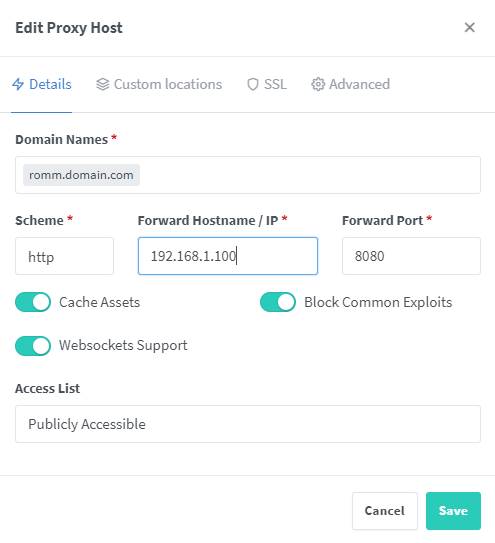

Here are some basic configurations for popular reverse proxies. Some installations may require modifications to config options not listed below.

## Caddy

```caddyfile
http://romm.mysite.com {
  reverse_proxy romm:8080
}
```

### Caddy + TLS (HTTPS)

```caddyfile
https://romm.mysite.com {
  tls mysite.com.crt mysite.com.key  # Certificate and key files

  encode zstd gzip

  header * {
    Strict-Transport-Security "max-age=31536000;"
    X-XSS-Protection "1; mode=block"
    X-Frame-Options "SAMEORIGIN"
    X-Robots-Tag "noindex, nofollow"
    -Server
    -X-Powered-By
  }

  reverse_proxy romm:8080
}
```

## Nginx

```nginx
server {
  listen 80 default_server;
  server_name romm.mysite.com;
  client_max_body_size 0;

  location / {
    include /config/nginx/proxy.conf;
    include /config/nginx/resolver.conf;
    set $upstream_app romm;
    set $upstream_port 8080;
    set $upstream_proto http;
    proxy_pass $upstream_proto://$upstream_app:$upstream_port;
  }
}
```

### Nginx + TLS (HTTPS)

```nginx
server {
  listen 80 default_server;
  server_name _;
  return 301 https://$host$request_uri;
}

server {
    listen 443 ssl http2;
    listen [::]:443 ssl http2;

    server_name romm.mysite.com;
    include /config/nginx/ssl.conf;
    client_max_body_size 0;

    location / {
      include /config/nginx/proxy.conf;
      include /config/nginx/resolver.conf;
      set $upstream_app romm;
      set $upstream_port 8080;
      set $upstream_proto http;
      proxy_pass $upstream_proto://$upstream_app:$upstream_port;

      # Hide version
      server_tokens off;

      # Security headers
      add_header X-Frame-Options "SAMEORIGIN" always;
      add_header X-Content-Type-Options "nosniff" always;
      add_header X-XSS-Protection "1; mode=block" always;
      add_header Strict-Transport-Security "max-age=31536000; includeSubDomains" always;
      add_header Referrer-Policy "no-referrer-when-downgrade" always;
    }
}
```

## Nginx Proxy Manager

Items marked with ❗ are important to set, as RomM may not correctly otherwise!

#### ⚡ Details

* Domain Names: `romm.mydomain.com` (replace mydomain with your own)* Scheme: `http`
* Forward Hostname/IP: <device IP> (like 192.168.X.X)
* Forward Port: `8080`
* Cache Assets: `off`
* Block Common Exploits: `on`
* Websockets Support: `on` ❗
* Access List: -

#### 🛡️ SSL

Strongly recommended, but only required if you plan to secure your site (use HTTPS)

* SSL Certificate: "Request a new SSL Certificate"
* Force SSL: `on`
* HTTP/2 Support: `on`
* HSTS Enabled: `off`
* Email Address for Let's Encrypt: <your email address>
* I Agree to the TOS: `on`

#### ⚙️ Advanced

Custom Nginx Confguration ❗
```
proxy_max_temp_file_size 0;
```

|Details|SSL|Advanced|
|---|---|---|
||||

## Traefik

### Using a configuration document

```yaml
http:
    romsdomainse:
      entryPoints:
        - "https"
      rule: "Host(`roms.domain.se`)"
      middlewares:
        - default-headers
        - https-redirectscheme
      tls:
        certResolver: http
      service: romsdomainse

services:
    romsdomainse:
      loadBalancer:
        servers:
          - url: "http://192.168.1.100:8080"
        passHostHeader: true
```

### Using labels in docker compose

```yaml
labels:
  - "traefik.enable=true"
  - "traefik.http.services.romm.loadbalancer.server.port=8080"
  - "traefik.http.routers.romm.rule=Host(`romm.YOUR_DOMAIN.com`)"
  - "traefik.http.routers.romm.entrypoints=websecure"
  - 'traefik.http.routers.romm.tls=true'
  - 'traefik.http.routers.romm.tls.certresolver=https'
```
