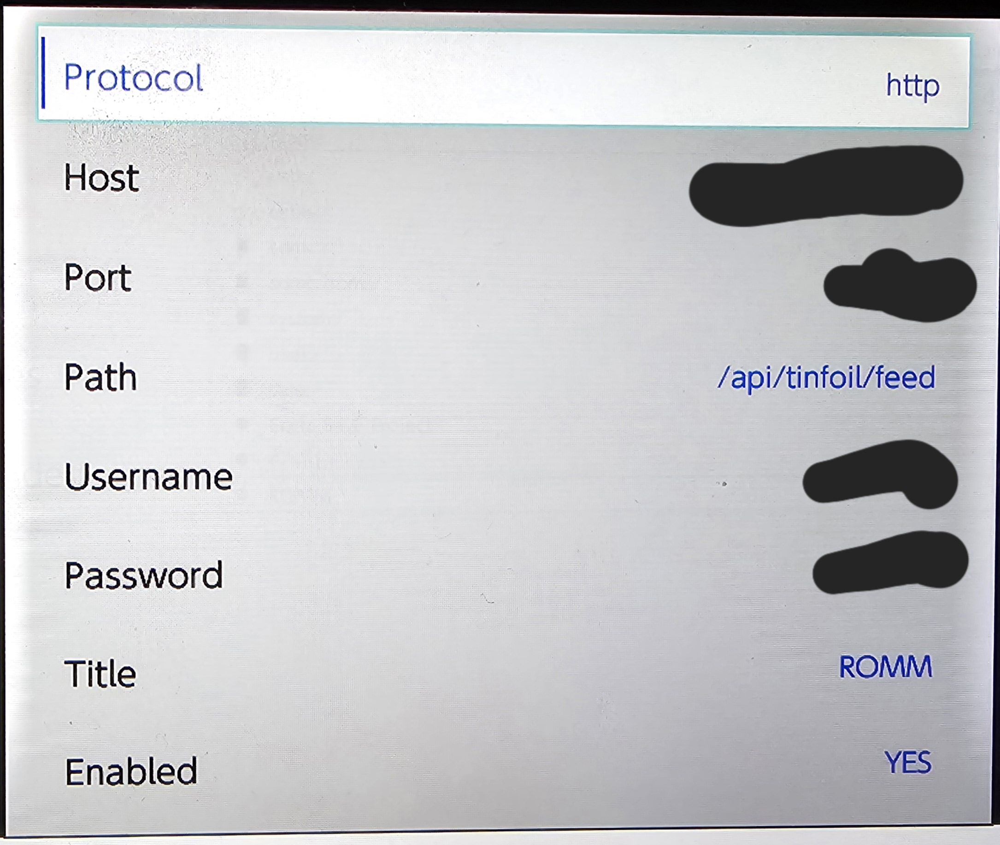

This will help you configure the [Tinfoil](https://tinfoil.io/) integration for your Switch to work with your RomM library.

- [Prepare](#prepare)
- [Configure](#configure)
- [Additional](#additional)
- Enjoy!

{ width="200" .skip-lightbox }
/// caption
///

## Prepare

Please note down the following in order to make this as smooth as possible, as well as some pre-reqs:

* RomM updated to at least [3.5.0](https://github.com/rommapp/romm/releases/tag/3.5.0)
* Add `DISABLE_DOWNLOAD_ENDPOINT_AUTH=true` to your environment variables and restart the container
* The URL you use to access RomM
	* This can either be http or https
	* The system will prefer local access though to avoid reverse proxy issues
* Feed URL: `/api/tinfoil/feed`
* The username and password you use to login to RomM

## Configure

Now it's time to configure your switch - Please follow the steps, this will assume you have Tinfoil installed and know how to use the basic functions of it.

1. Open Tinfoil and go to File Browser
2. Scroll over to the selection and press - in order to access the new menu.
3. Enter these Options
	- Protocol - Http or https depending on your connection
	- Host - Host of your RomM instance
	- Port - Port of your RomM Instance
	- Path - /api/tinfoil/feed
	- Username - Username of your RomM instance
	- Password - Password of your RomM instance
	- Title - Free text title, make it whatever you want.
	- Enabled - Yes
4. Press X to save
5. Now close out of Tinfoil and go back in, so it can scan the TitleIDs - if everything is correct you will have this custom motd:
" RomM Swithc Library"

Now you will be able to see the files in "New Games" tab of Tinfoil OR you can access it within the "File Browser" section that you setup earlier.

/// caption
///

## Additional

It didn't pull anything through to "New Games" and has not parsed any information about the titles?!

That would be becasue the filename it has tried to pull had no TitleID (Improvement to RomM coming soon :tm:)

Make sure the filename has the TitleID within the title like this:

/// caption
///

Once this is done, the next time Tinfoil is opened it is always parsed and re-scanned.
