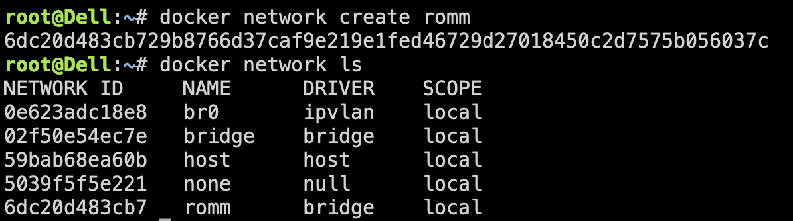
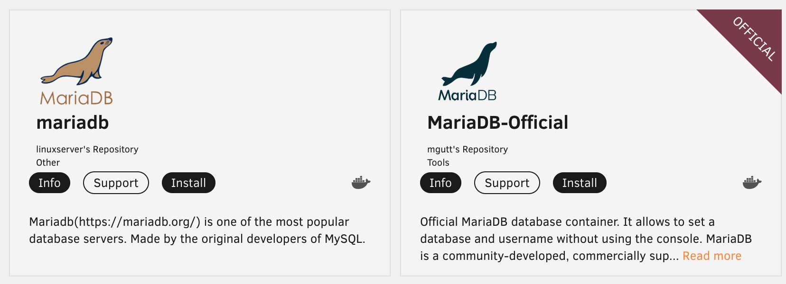
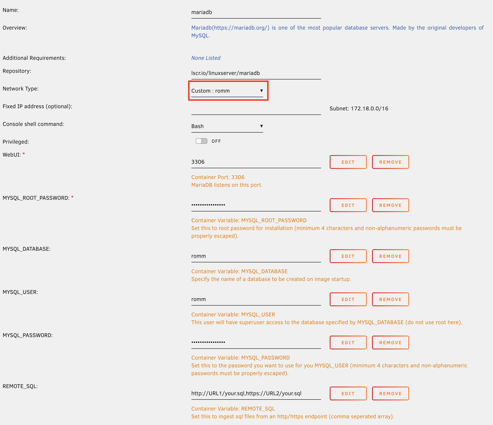
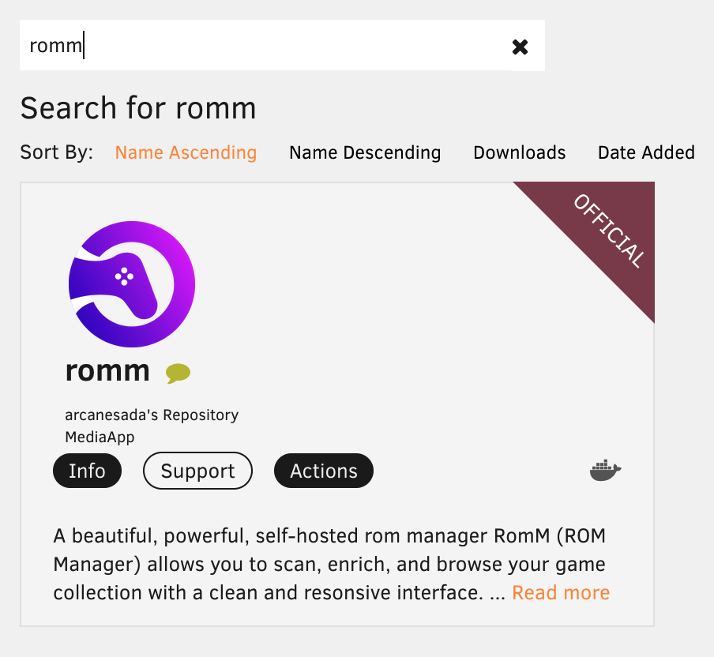
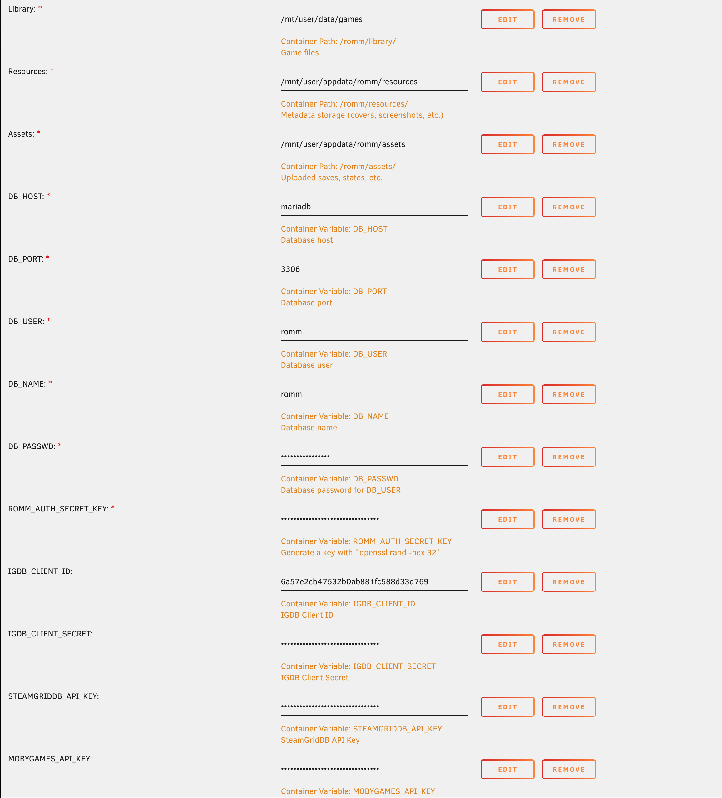
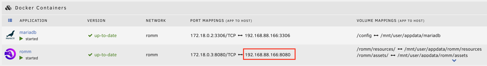

## Prerequisites

Before getting started, install the [Community Apps plugin](https://forums.unraid.net/topic/38582-plug-in-community-applications/) for Unraid.

### Docker network

You'll want to create a custom bridge-type network for both containers to communicate with each other. This will prevent a number of common issues Unraid users tend to come across during setup. This can be done with the following command: `docker network create romm`, and you can verify it worked with `docker network ls`.

### MariaDB

MariaDB is required to run RomM, so install it from the plugin registry. Only the [official](https://hub.docker.com/_/mariadb) and [linuxserver](https://github.com/linuxserver/docker-mariadb/pkgs/container/mariadb) versions are supported, but **the official version is preferred**.

Now fill in all the environment variables; descriptions of the options and sensible defaults are listed in the [example docker-compose.yml](https://github.com/rommapp/romm/blob/release/examples/docker-compose.example.yml) file.

> [!WARNING]
> The network type must be set to "Custom: romm"

## Installation

From the Unraid dashboard, click `APPS` in the navbar. In the search bar, search for `romm`, and install the app listed as "OFFICIAL". This one is maintained by our team and is the most up-to-date.

## Configuration

Configure the required environment variables, ports and paths as per the [example docker-compose.yml](https://github.com/rommapp/romm/blob/release/examples/docker-compose.example.yml) file.

!!! warning
    The network type must also be set to "Custom: romm"

Apply the changes, then head to the `DOCKER` tab. You should see both containers in a running state, and can access RomM using the IP:PORT of the container (highlighted below).

### Updating

\*\*It's strongly recommended to backup the `appdata` folder (or mount it in a safe location) before updating, since tearing down the container will wipe the resources (covers, screenshots, etc.)

## Video tutorial

!!! note "How to Install RomM on Unraid (Beginner Friendly)"
    [DemonWarriorTech](https://www.youtube.com/@DemonWarriorTech) has published [How to Install RomM on Unraid (Beginner Friendly)](https://www.youtube.com/watch?v=Oo5obHNy2iw) on installing and running RomM on Unraid for Beginners with an in depth instructions and explanation of the software install and how to use it.
    <iframe width="100%" height="315" src="https://www.youtube.com/embed/Oo5obHNy2iw" title="How to Install RomM on Unraid" frameborder="0" allow="accelerometer; autoplay; clipboard-write; encrypted-media; gyroscope; picture-in-picture" allowfullscreen></iframe>

!!! note "Easy Game ROM Management on Unraid"
    [AlienTech42](https://www.youtube.com/@AlienTech42) has published [a great video](https://www.youtube.com/watch?v=ls5YcsFdwLQ) on installing and running RomM on Unraid. While a bit out of date vis-a-vis install instructions, it's still very useful for general setup and debugging. Check it out!
    <iframe width="100%" height="315" src="https://www.youtube.com/embed/ls5YcsFdwLQ" title="Easy Game ROM Management on Unraid" frameborder="0" allow="accelerometer; autoplay; clipboard-write; encrypted-media; gyroscope; picture-in-picture" allowfullscreen></iframe>

## Shoutouts

We want to give a special shoutout to @Smurre95 and @sfumat0 for their help documenting this process, and working towards getting RomM listed in CA. 🤝
